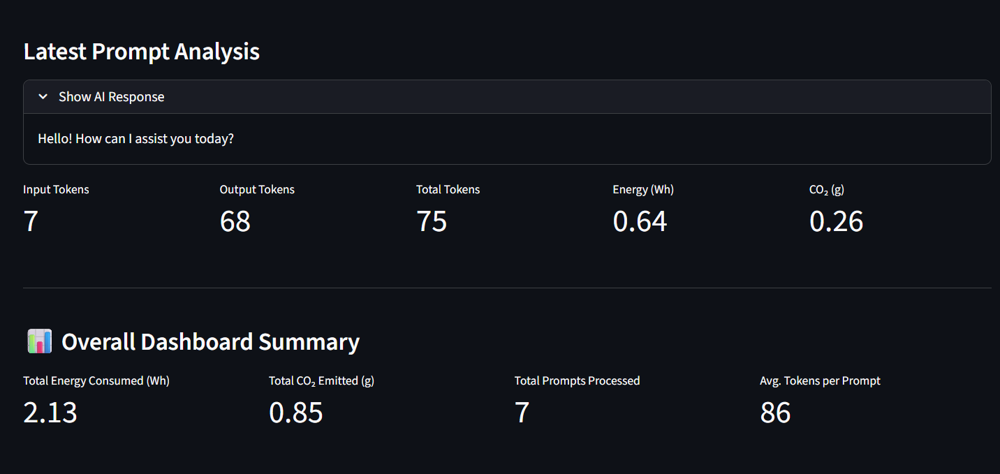
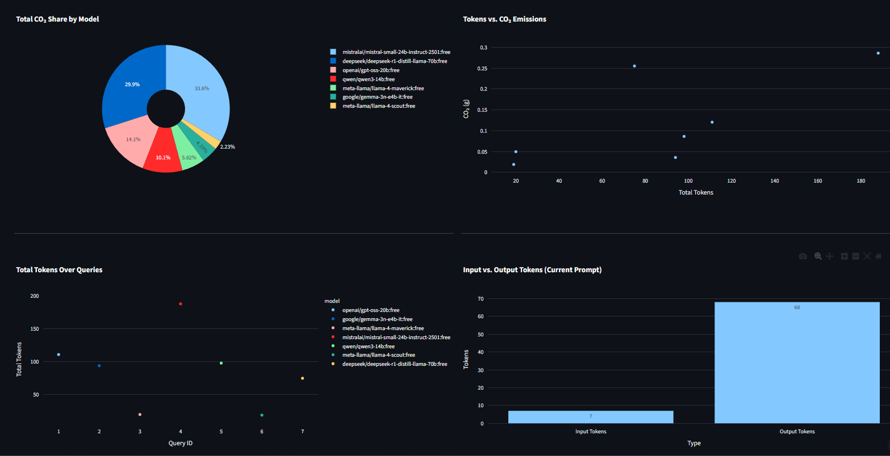

# ⚡ AI Energy & CO₂ Dashboard

<div align="center">
  
  
  
  
  <br>
</div>

---

Measure, visualize, and compare the environmental footprint of LLM inference across different models — in real time. Gain insights into model efficiency, environmental impact, and make informed, greener choices for your AI workflows.


## 🚀 Deployment

[]( https://ai-sustainable-co2-energy-dashboard.streamlit.app/)

[](https://ai-sustainable-co2-energy-dashboard.streamlit.app)


## 📱 Demo

  <table>
  <tr>
    <td align="center">
      <br/>
      <b>Dashboard View</b>
    </td>
    <td align="center">
      <br/>
      <b>Analytics View</b>
    </td>
  </tr>
</table>


## 🌍 Overview

This interactive Streamlit app estimates electricity usage and CO₂ emissions produced when running prompts on different large language models via OpenRouter. It tracks token usage, estimates energy consumption, and visualizes the total and per‑prompt environmental impact — helping you make greener AI choices.


### What you can do

- 🧪 Run prompts against multiple AI models
- 🔋 Estimate energy use (kWh) per query
- 🌫️ Convert energy to CO₂ emissions (kg), using a US grid average factor
- 📈 Explore charts for trends, correlations, and model share
- 🗂️ Review a query history with tokens, energy, and CO₂ per run
- 📊 Compare models on efficiency and environmental impact


## 🧠 How it works

The app calls OpenRouter’s chat completion API, reads token usage, and applies model‑specific energy factors to estimate electricity and emissions.


### 🧮 Footprint calculations

- Energy factor by model (**Wh per 1K tokens**)
- US grid average emission factor: **0.4 g CO₂ per Wh** (configurable in code)

Formulas:

- $E_{Wh} = \dfrac{\text{tokens}}{1000} \times \text{energyFactor(model)}$
- $\text{CO₂}_{g} = E_{Wh} \times 0.4$


### 📦 Model energy factors (defaults in code)

| Model                                              | Wh / 1K tokens |
|----------------------------------------------------|---------------:|
| deepseek/deepseek-r1-distill-llama-70b:free        |         8.50   |
| openai/gpt-oss-20b:free                            |         2.71   |
| google/gemma-3n-e4b-it:free                        |         0.95   |
| meta-llama/llama-4-maverick:free                   |         6.20   |
| mistralai/mistral-small-24b-instruct-2501:free     |         3.80   |
| qwen/qwen3-14b:free                                |         2.20   |
| meta-llama/llama-4-scout:free                      |         2.50   |
| default (fallback)                                 |         2.56   |

> These are illustrative factors intended for relative comparison, not lifecycle‑accurate measurements.


## 🧷 Key screens

- 📨 Latest Prompt Analysis: response viewer with token/energy/CO₂ metrics
- 🧭 Dashboard KPIs: total energy, total CO₂, prompts processed, avg tokens per prompt
- 📊 Statistical Analysis: average and median CO₂ per prompt
- 📉 Charts & Analytics:
	- CO₂ share by model (pie)
	- Tokens over time (line)
	- Tokens vs CO₂ correlation (scatter/line)
	- Input vs Output tokens for the latest prompt (bar)
- 📖 Query History table


## 🛠️ Local setup (Windows / PowerShell)

1) Clone or download this repository.

2) Create a virtual environment (optional but recommended):

```powershell
python -m venv .venv
.\.venv\Scripts\Activate.ps1
```

3) Install dependencies:

```powershell
pip install -r requirements.txt
```

4) Run the app:

```powershell
streamlit run app.py
```

5) Open the Streamlit sidebar and paste your OpenRouter API key when prompted.


## 🔑 Configuration

OpenRouter API key is entered securely via the Streamlit sidebar at runtime.


## 📚 Project structure

```
app.py              # Streamlit app
requirements.txt    # Python dependencies
Readme.md           
public/             # static assets
```


## 🧭 Usage guide

1. Enter your OpenRouter API key in the sidebar.
2. Select a model from the dropdown.
3. Type your prompt and click “Generate & Analyze.”
4. Review the AI response, token usage, energy, and CO₂ output.
5. Explore the analytics and history to compare models and prompts.


## 🧩 Tech stack

- 🖼️ Streamlit for UI and state management
- 🔗 Requests for API calls
- 🧮 Pandas for data handling
- 📈 Plotly Express for interactive charts


## 🤝 Contributing

Contributions are welcome! Please feel free to submit a Pull Request.


## 📜 License

This project is licensed under the MIT License.
